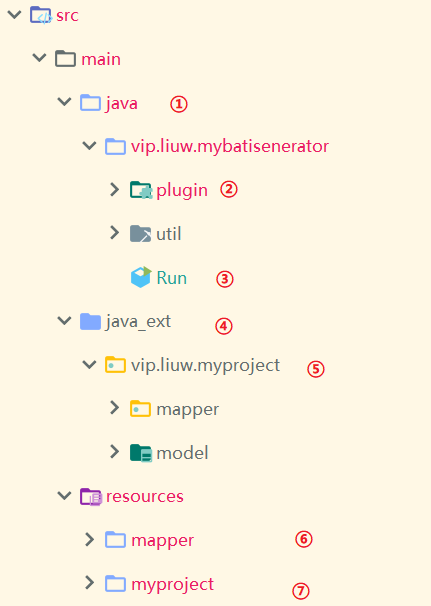
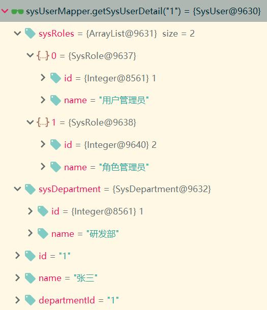

# mybatis-generator

使用MyBatis官方的生成器，添加自定义插件，生成项目所需的文件  
参考：[MyBatis Generator官方文档](`http://www.mybatis.org/generator/`)

# 使用步骤

## 添加项目配置文件
在资源文件夹 resources下新建一个目录对应你的项目，复制myproject/config.properties和myproject/config.xml到该目录。
### config.xml修改
- `<properties resource="myproject/config.properties"/>`修改为你新建的config.properties
- plugin为插件节点，可以根据需求自己修改
### config.properties修改
必须修改的是数据库连接信息，其它的根据文件内注释自行配置

# 运行
1. 先修改Run.java中要读取的配置文件`String fileName = "/myproject/config.xml";`为你的新建的config.xml
2. 运行Run.java的main方法

# 项目结构
  
① 本项目的核心类目录  
② 自定义插件位置  
③ 项目运行入口  
④ 扩展类目录，存放外部项目的相关类，比如生成的Model或Mapper需要继承基类，而每个项目包名一般都不一样，
把这些类放入java_ext下面  
⑤ 以myproject举例，演示了插件的一些用法  
⑥ myproject中使用的mapper  
⑦ 生成myproject所需文件的配置类，其下的config_all.xml含有最全的配置和注释  

# 自定义插件
## 添加自定义插件步骤
- 新建Java类MyPlugin继承`org.mybatis.generator.api.PluginAdapter`，在里面实现自己的逻辑
- 在xml的context节点中添加plugin节点，plugin的属性type指定MyPlugin的全路径。plugin的子节点property可以添加属性，
在MyPlugin中重写setProperties方法来获取

## 别名插件(AliasPlugin)
`mybatis`的映射文件中经常用到`select *`, 对于单表来说没有问题，但用到多表联查时，相同的字段时，如`id`, `type`, `status`等，
会变成`id1`, `type1`, `status1`，这样在转换成对象的时候就丢失了这个字段，并且对象中有这些字段的都会使用第一个id， 
不注意的话就出问题了。我们采用起别名的方式，可以很好的解决这个问题，但起别名不仅要在`select`后面加上一堆关于别名的字段，
还要在重新定义一个对应别名的`resultMap`，显得繁琐，使用插件后生成的Base_Column_List解决了这个问题。  
SysUserMapper.xml:  
```
    <sql id="Base_Column_List">
            su.`id` as `su_id`, su.`name` as `su_name`, su.`department_id` as `su_department_id`
    </sql>
```
其中`<select id="getSysUserDetail" resultMap="ResultMapWithRole">`方法对sql片段使用做出了示范，
同时把association和collection的使用也展示了。  
该方法查询出的结果如下  


[初始化数据库(MySQL)](doc/initdb.sql)
## model插件(ModelPlugin)
```
        <dependency>
            <groupId>org.projectlombok</groupId>
            <artifactId>lombok</artifactId>
            <version>1.16.20</version>
        </dependency>
```
项目添加该jar后可以在精简javaBean，在model类上面添加@Getter、@Setter，在代码中就不用再生成getter和setter方法了，而在编译时会自动加上。
这些方法占用了大量篇幅，对于开发阶段却没有什么用，每次修改字段后还要重新生成该字段的对应方法。
在idea中使用需要添加一个插件（IntelliJ Lombok plugin）。